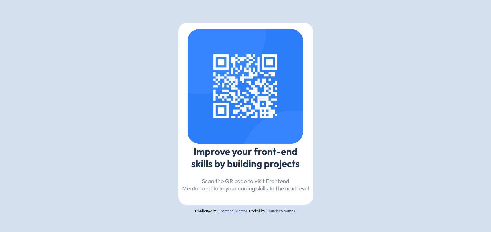

# Mentor de Frontend - solução de componente de código QR

Esta é uma solução para o [QR code component challenge on Frontend Mentor](https://www.frontendmentor.io/challenges/qr-code-component-iux_sIO_H). Os desafios do Frontend Mentor ajudam-no a melhorar as suas capacidades de codificação através da construção de projectos realistas. 

## Tabela de conteúdos

- [Visão Geral](#overview)
  - [Captura de ecrã](#screenshot)
  - [Links](#links)
- [O meu processo](#my-process)
  - [Construído com](#built-with)
  - [O que aprendi](#what-i-learned)
  - [desenvolvimento continuado](#continuação do desenvolvimento)
  - [Recursos úteis](#recursos úteis)
- [Autor](#autor)
- [Agradecimentos](#acknowledgments)

**Note: Apague esta nota e actualize o índice com base nas secções que guarda.**

## Visão geral

### Imagem de ecrã

### Ligações

- URL da solução: [Adicione aqui o URL da solução](https://your-solution-url.com)
- URL do sítio em directo: [Adicione aqui o URL do sítio em directo](https://your-live-site-url.com)

## O meu processo

#### Construído com

- Marcação HTML5 semântica
- Propriedades personalizadas do CSS

### O que aprendi

Coloquei meus conhecimentos em prática na utilização de HTML e CSS3

## Autor

- Github - [Francisco Santos](https://github.com/Outercrescent3)
- Frontend Mentor - [@Outercrescent3](https://www.frontendmentor.io/profile/Outercrescent3)

